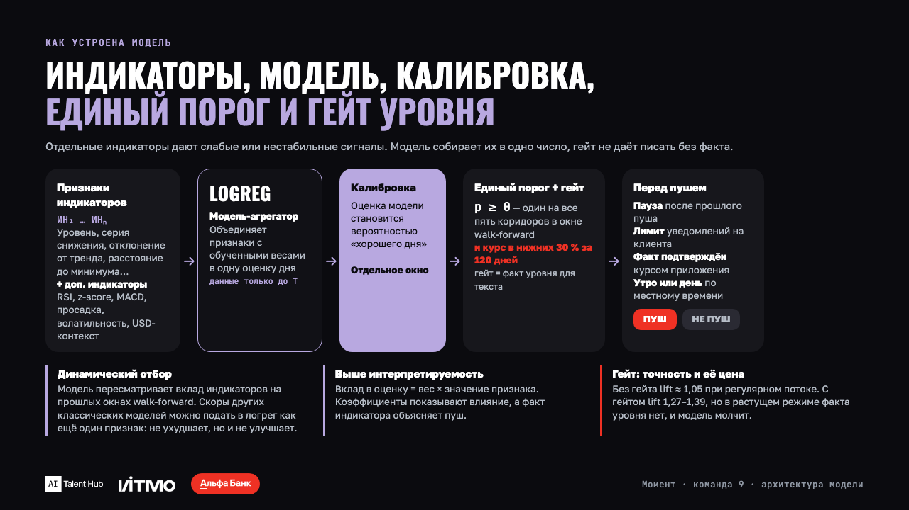
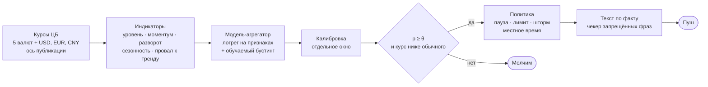
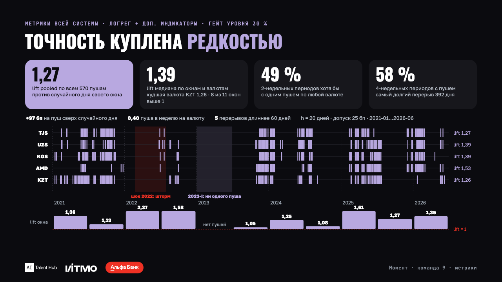
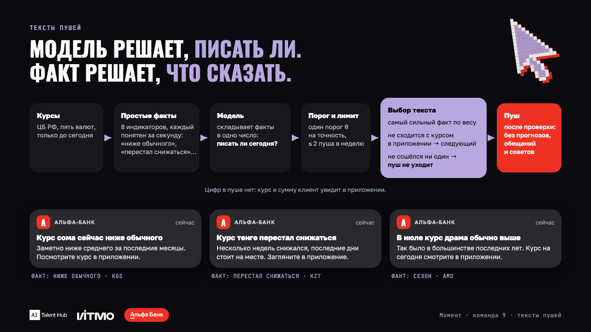

# Момент — сигнальный слой «выгодный момент для перевода за рубеж»

**AI Product Hack 2026** (AI Talent Hub × ИТМО) · кейс 455 Альфа-Банка · команда 9: Даниил Бурдыгин, Илья Фазлов, Олег Андреев

> Клиент переводит рубли в Таджикистан, Узбекистан, Кыргызстан, Армению или Казахстан и сам угадывает день. Мы по открытым курсам ЦБ считаем, **когда есть повод ему написать, что сказать и когда доставить**, и доказываем это walk-forward бэктестом без единого взгляда в будущее.

`Python 3.12` · `uv` · `155 тестов` · `5 коридоров` · `11 окон walk-forward 2021–2026` · `тест на заглядывание вперёд` · `чекер текстов`



## За 60 секунд

- **Что.** Пять коридоров RUB→TJS/UZS/KGS/AMD/KZT на дневном фиксинге ЦБ 2015→2026 (часовые свечи Мосбиржи и фьючерсы Si/CR — для проверки). Шесть базовых индикаторов, обучаемый индикатор, модель-агрегатор, единый порог, политика потока, библиотека текстов с чекером комплаенса.
- **Как проверено.** Purged walk-forward: 11 полугодовых окон, зазор 20 дней, калибровка и порог на отдельном окне, функция среза «сигналы на дату T» совпадает с полным прогоном, тест на заглядывание вперёд в `tests/test_no_lookahead.py`.
- **Что получилось.** Уровень даёт lift 1,05–1,16 и +39…+70 бп сверх случайного дня на всех пяти коридорах. Модель-агрегатор с гейтом уровня — lift 1,39 по медиане окон и +97 бп на пуш. Моментум не отличим от случайного дня, и мы говорим это прямо.
- **Звёздочка.** Кликабельный клиентский путь из пуша в перевод, экран «сигнал устарел», окно доставки по местному времени, предзаполненная форма.

## Как это работает



| Слой | Где в коде | Что важно |
|---|---|---|
| Данные и ось публикации | `src/fxmoment/data/` | курс на завтра публикуется сегодня: pub_date = eff_date − 1, номиналы нормированы, выходные не считаются движением |
| Индикаторы | `src/fxmoment/indicators/` | каждый — каузальная функция от прошлого; калибруются на обучении по медиане годовых lift |
| Обучаемый индикатор и агрегатор | `indicators/ml.py`, `experiments/logreg-v1/` | бустинг на признаках индикаторов с гейтом уровня; логрег-агрегатор с единым порогом на пять коридоров |
| Разметка и метрики | `labels.py`, `metrics.py` | попадание «сейчас выгодно» в трёх прочтениях (min / mean / end), «окно закрывается», выгода в бп, частота, кучность, бутстреп по месяцам |
| Бэктест | `backtest/` | walk-forward, функция среза `signals --as-of`, контроль без калибровки `--fixed-params` |
| Политика потока | `combine/policy.py` | ранг по надёжности на прошлых окнах, отключение без lift, конфликты, охлаждение, лимит 1–2 в неделю, шторм по волатильности |
| Тексты | `texts/library.py`, `check-texts` | только факты о прошлом и настоящем; регулярный чекер запрещённых формулировок |

## Что показал бэктест

Окна 2021-01…2026-06, h = 20 дней, допуск 25 бп, база — случайный день того же окна. Полные таблицы: `reports/latest/README.md`, анализы — `reports/latest/analysis/README.md`, состояние — `docs/STATUS.md`.

| Что | Результат | Где смотреть |
|---|---|---|
| Уровень (`level`) | lift 1,05–1,16, +39…+70 бп, 0,23–0,43 пуша/нед.; ≥ 1 на всех коридорах, параметры переносимы между коридорами | `reports/latest/` |
| Обучаемый (`ml_localmin`) | lift 0,89–1,49, лучший по точности на 4 из 5 коридоров, редкий | `reports/latest/`, `reports/ml-pooled/` |
| Провал к тренду, сезонность | до 1,5 на отдельных коридорах, плохо переносятся | `reports/latest/` |
| Моментум, «окно закрывается» | 0,94–1,02 и 0,79–1,15: не отличимы от случайного дня — честный отрицательный результат | `docs/product/limitations.md` |
| Итоговый поток после политики | 735 пушей за 5,5 лет, 0,38–0,65 в неделю на коридор, пустых месяцев 8–27 % | `reports/latest/` |
| Цена ожидания (быстрый → медленный) | ждать подтверждения уровня лучше, чем слать по моментуму сразу, на 5 из 5 коридоров: +18…+52 бп на пуш против −24…+8 | `analysis/price_of_waiting*` |
| Календарь «первый день с 25-го» | lift 1,12, +71 бп при 0,23 в неделю — нижний слой продукта, стек его не обгоняет | `analysis/` |
| Окно клиента | оракул +232 бп к привычке; пуш в окне с пушем +85 бп, 254 ₽ с перевода 30 000 ₽ | `analysis/client_window*` |
| Модель-агрегатор V1 (эксперименты) | логрег + доп. индикаторы + гейт уровня: lift 1,39 по медиане, 1,27 по всем пушам, +97 бп, 0,40 в неделю; без гейта 1,05–1,09 при регулярном потоке | `experiments/logreg-v1/` |
| Устаревание сигнала | факт пуша доживает до утра у 93 % пушей | `analysis/` |



Что внутри модели: три самых показательных признака и их доля в пушах — `docs/img/indicators.png`. Полный разбор весов по окнам — `experiments/logreg-v1/results/weights_by_window.csv`.

## Задача со звёздочкой

- **Клиентский путь из пуша.** Пуш открывает страну сразу, клиент попадает на выбор способа перевода с графиком курса и фактом сверху, дальше получатель, назначение, сумма и проверка. Кликабельное демо — страницы 2–17 финальной презентации, разбор пути — `docs/product/customer-journey.md`, `docs/product/concept.md`.
- **Сигнал устарел.** При открытии пуша факт сверяется ещё раз. Если не сходится — экран с извинением за сигнал, текущим курсом и выбором «посмотреть курс» или «напомнить при новом сигнале». Прототип с тремя состояниями и журналом попаданий — `prototype/index.html`; обоснование механики по практикам финтеха, тревела и e-commerce — `docs/product/star-task-research.md`.
- **Часовые пояса.** ЦБ публикует курс на завтра днём; расчёт и решение — в 17:00 МСК, пуш ждёт окна 09:00–21:00 местного времени клиента (пояса от МСК−1 до МСК+9) и перед отправкой сверяется с курсом приложения. Вечерний гейт и его цена — `analysis/evening_gate.csv`.
- **Тексты.** Модель решает, писать ли; факт решает, что сказать. Три факта с текстами без цифр, кнопок и обещаний — `docs/product/texts.md`, проверка — `uv run fxmoment check-texts`.



## Запуск за пять минут

Нужны Python 3.12 и [uv](https://docs.astral.sh/uv/). Снимки данных лежат в `data/raw/`, без сети всё воспроизводится по ним. Пошаговая проверка с чистого клона — `docs/process/clean-clone-check.md`.

```bash
uv sync --group dev                          # окружение
uv run pytest                                # 155 тестов, включая тест на заглядывание вперёд
uv run fxmoment backtest                     # walk-forward бэктест всех индикаторов → reports/latest/
uv run fxmoment analyze                      # цена ожидания, фронтир, окно клиента, праздники, вечерний гейт
uv run fxmoment signals --as-of 2026-06-15   # сигналы, как они выглядели бы на дату среза
uv run fxmoment check-texts                  # библиотека текстов через чекер запрещённых формулировок
uv run fxmoment timemachine                  # страница «сигналы как на дату T» → prototype/timemachine.html
```

Свежие данные: `uv run fxmoment fetch` (ЦБ) и `uv run fxmoment fetch-moex` (Мосбиржа). Вариантные прогоны — флагами `backtest`: `--fixed-params`, `--first-test`, `--rank-base month`, `--ml pooled`, `--with-level-drift`, `--freq-band`, `--signal-source USD`; сравнение с основным — `compare-runs --variant <имя>`. Эксперименты с моделью-агрегатором — `experiments/logreg-v1/README.md`.

## Соответствие условиям кейса

Условия дословно — `docs/case/case-455-talenttrack.md`, ответы кейсодателя — `docs/case/qa-2026-09-02.md`, критерии — `docs/case/evaluation-criteria.md`.

| Пункт постановки | Как закрыт | Где |
|---|---|---|
| 1. Данные по пяти коридорам за 5+ лет | ЦБ 2015→2026 по 8 валютам, номиналы нормированы, ось публикации; часовые свечи Мосбиржи и фьючерсы для сверки | `data/raw/`, `src/fxmoment/data/` |
| 2. Библиотека базовых индикаторов | моментум, уровень, разворот, сезонность, провал к тренду, уровень с поправкой на дрейф | `src/fxmoment/indicators/` |
| 3. Обучаемые индикаторы | бустинг «локальный минимум ±h с порогом» на признаках индикаторов; логрег-агрегатор, стек, блэнды | `indicators/ml.py`, `experiments/logreg-v1/` |
| 4. Метрика правдивости | «сейчас выгодно»: курс не хуже h дней в трёх прочтениях с допуском; «окно закрывается»: курс действительно вырос | `labels.py`, ADR-0003 |
| 5. Walk-forward бэктест: частота, кучность, пустые месяцы | 11 окон, зазор 20 дней, функция среза, тест на утечку | `backtest/`, `metrics.py`, `tests/test_no_lookahead.py` |
| 6. Быстрые и медленные, цена ожидания | пары моментум → уровень, стратегии «сразу» и «дождаться» на одних окнах | `analysis/price_of_waiting*` |
| 7. Комбинирование в единый поток | ранг по надёжности, конфликты, охлаждение, лимит, шторм; вариантные прогоны против основного | `combine/policy.py`, `reports/*/vs_latest/` |
| 8. Тексты по сценариям с комплаенсом | шаблоны индикатор × направление, чекер запрещённых фраз | `texts/library.py`, `docs/product/texts.md` |
| ★ Клиентский путь, время отправки, «момент изменился», обоснование, предзаполнение, прототип агентом | демо в презентации, прототип, исследование практик, вечерний гейт | `prototype/`, `docs/product/star-task*.md` |

Отчётные требования кейсодателя: инструкция запуска — выше и в `docs/process/clean-clone-check.md`; план пилота с метриками и сроком набора событий — `docs/product/pilot.md`; ограничения, риски и компромиссы — `docs/product/limitations.md`; лист ответов к защите — `docs/defense/qa.md`.

## Честно об ограничениях

- **Точность куплена редкостью.** Гейт по уровню поднимает lift до 1,3–1,4, но молчит в растущем режиме: первое полугодие 2023-го без единого пуша на всех валютах. Регулярность потока даёт второе семейство фактов, а не другая модель.
- **Сигнал слабый по построению.** На горизонте 1–5 дней ряд ЦБ не отличим от случайного блуждания; сигнал есть только на горизонте месяца. Календарное правило без индикаторов остаётся сильной базой.
- **Модель против правила.** Против правила «уровень» при той же частоте модель не отличается по lift, выигрывает по выгоде на пуш. Скоры других классических моделей на входе логрега качества не добавляют.
- **Отбор на тех же окнах.** Варианты моделей сравнивались на одних и тех же 11 окнах, лучшие цифры оптимистичны; интервалы по парам «коридор × окно» приведены в отчётах.
- **Вне скоупа** по условиям кейса: таргетинг «кому слать», интеграции, ценообразование, торговля, мобильный код, персональные данные.

Полный перечень — `docs/product/limitations.md`.

## Карта репозитория

| Путь | Что |
|---|---|
| `src/fxmoment/` | пакет: данные, индикаторы, разметка, метрики, бэктест, политика, тексты, анализы, CLI на четырнадцать команд |
| `tests/` | 155 тестов: каузальность каждого индикатора, функция среза, калибровка без будущего, политика, чекер текстов |
| `experiments/logreg-v1/` | стенды модели-агрегатора: данные, модели, доп. индикаторы, стек, регулярность; результаты и отчёты |
| `reports/` | `latest/` — основной прогон и анализы; `fixed/`, `intraday/`, `rank-month/`, `from2019/`, `ml-pooled/`, `level-drift/`, `precision/`, `ruble-signal/` и другие варианты с `vs_latest/` |
| `data/raw/` | снимки курсов ЦБ, часовых свечей Мосбиржи и фьючерсов с датой выгрузки |
| `prototype/` | экран «момент изменился» с журналом попаданий, машина времени «сигналы на дату T» |
| `docs/case/` | условия кейса дословно, переписка с кейсодателем, критерии, команда и дедлайны |
| `docs/decisions/` | ADR: принятые допущения и почему |
| `docs/product/` | концепция, путь клиента, тексты, пилот, звёздочка, размер рынка, ограничения |
| `docs/process/` | работа с ИИ-агентами, онбординг, проверка с чистого клона |
| `docs/img/` | слайды-иллюстрации к этому README |
| `deliverables/final/` | комплект к сдаче: презентация, описание, продуктовые и дополнительные материалы |
| `CLAUDE.md`, `AGENTS.md` | карта проекта для людей и агентов: инварианты, словарь, правила работы |

## Команда и процесс

| Кто | Роль |
|---|---|
| Даниил Бурдыгин | AI Product & Engineer, менеджер проекта: концепция, метрики успеха, тексты, пилот, прототип и демо, защита; архитектура и ядро `fxmoment` |
| Илья Фазлов | AI Engineer: данные, индикаторы, обучаемый индикатор, спецификация V1 и модель-агрегатор |
| Олег Андреев | AI Engineer: бэктест и метрики всей системы, интервалы, эксперименты с моделями и доп. индикаторами, разбор по ML System Design, слайды |

Трое пишут код каждый со своим ИИ-агентом по общему словарю проекта; что из этого измеримо — `docs/process/ai-workflow.md`. Уклад: ветка на задачу, PR в `main`, перед PR `uv run pytest` и `uv run ruff check .`.
